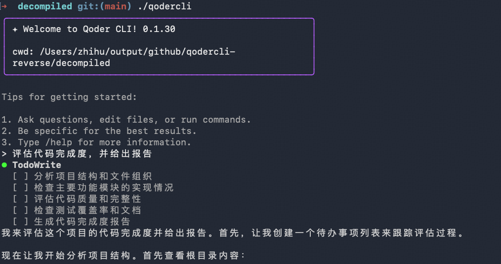
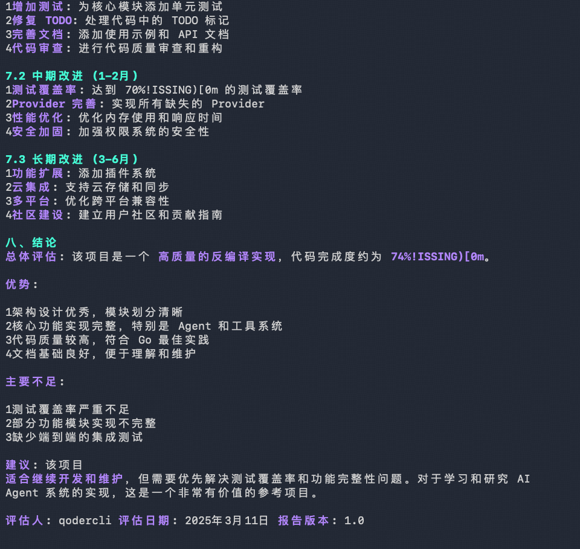

# qodercli 逆向分析项目

> **注意**: qodercli 是阿里巴巴内部的闭源项目。本项目通过逆向分析还原其架构，反编译结果可编译运行，仅供学习和研究使用。

## 项目目标

- **分析对象**: qodercli v0.1.29 (Mach-O arm64 Go binary, ~37MB)
- **分析方法**: 符号表分析、字符串提取、行为观察、配置分析
- **输出物**: 完整架构文档 + 反编译代码示例
- **反编译成果**: 成功还原核心架构，反编译代码可编译运行

## 项目状态概览

本项目已完成核心架构逆向分析，主要功能模块实现状态如下：

### ✅ 已完整实现
- **核心架构分析**: 完整架构文档已生成
- **Agent 核心系统**: 消息循环、工具调用、权限控制
- **TUI 交互界面**: Bubble Tea 框架 + Markdown 渲染
- **基础工具集**: Read/Write/Edit/Grep/Bash/Glob/Delete 等 9 个工具
- **权限安全系统**: 细粒度规则引擎，Hook 拦截机制

### 🔄 部分实现（核心功能可用）
- **多 Provider 支持**: Qoder + OpenAI 可用，支持扩展其他 Provider
- **MCP 协议集成**: Client 库已实现，支持 stdio/SSE 传输
- **CLI 命令框架**: 基础 CLI 功能可用，支持交互模式
- **配置管理系统**: 基础配置结构，支持模型选择和基础设置
- **运行模式支持**: 交互模式完整，其他模式待完善

### ⏳ 待实现功能
- **会话管理**: 会话持久化、恢复功能
- **高级工具扩展**: WebFetch/WebSearch/Task/TodoWrite/Skill 等
- **MCP 管理功能**: CLI 子命令、服务器管理、OAuth 认证
- **Jobs 并发系统**: worktree 任务管理
- **SubAgent 系统**: 子代理调度和执行
- **GitHub 集成**: PR 创建、代码审查、Actions 集成

**详细差距分析**: 参见 [反编译差距分析文档](docs/11-decompiled-gap-analysis.md)

**完成时间**: 2026-03-09

## 完成效果展示

以下是 qodercli 的实际运行界面截图，展示了逆向分析项目的完成效果：

### 截图 1: qodercli 交互界面 (1014×536)


### 截图 2: qodercli 工具使用界面 (960×909)


## 文档目录

```
docs/
├── architecture-overview.md      # 完整架构概览
├── official-architecture.md      # 官方 qodercli 架构分析（重构参考）
├── 01-package-structure.md       # 包结构和依赖
├── 02-cli-commands.md            # CLI 命令系统
├── 03-llm-integration.md         # LLM 集成
├── 04-mcp-protocol.md            # MCP 协议
├── 05-tools-system.md            # 工具系统
├── 06-session-management.md      # 会话管理
├── 07-permission-security.md     # 权限安全
├── 08-config-api.md              # 配置和 API
├── 09-github-integration.md      # GitHub 集成
├── 10-subagent-skill.md          # SubAgent 和 Skill
├── 11-decompiled-gap-analysis.md # 反编译差异分析
└── 12-bubbletea-analysis.md      # Bubble Tea 使用分析
```

## decompiled 目录架构

```
decompiled/
├── cmd/                          # CLI 命令入口
│   └── root.go
├── core/                         # 核心逻辑
│   ├── agent/                    # Agent 系统
│   │   ├── agent/agent.go        # 主循环
│   │   ├── provider/             # LLM Provider
│   │   ├── tools/                # 工具实现
│   │   ├── permission/           # 权限控制
│   │   └── state/                # 状态管理
│   ├── config/                   # 配置加载
│   ├── resource/mcp/             # MCP 客户端
│   ├── pubsub/                   # 事件系统
│   └── types/                    # 类型定义
├── tui/                          # TUI 界面
│   ├── app/                      # 应用启动
│   └── components/               # UI 组件
├── main.go                       # 程序入口
└── go.mod/go.sum                 # 依赖管理
```

**代码统计**: 约 15 个文件，~3350 行代码

## 核心架构

```
┌─────────────────┐
│   CLI / TUI     │
└────────┬────────┘
         │
┌────────▼────────┐
│   Agent Core    │  ← 主循环、Provider、Tools、Permission
└────────┬────────┘
         │
┌────────▼────────┐
│   Resources     │  ← MCP、Skill、SubAgent
└────────┬────────┘
         │
┌────────▼────────┐
│   Utilities     │  ← HTTP、Token、Storage、API
└────────┬────────┘
```


## 开发工作流程

在修改或扩展代码前，必须遵循以下逆向分析流程，确保实现与官方架构保持一致：

### 1. 定位官方二进制

```bash
# 找到官方 qodercli 二进制文件位置
which qodercli
# 输出示例: /Users/zhihu/.qoder/bin/qodercli/qodercli-0.1.29
```

### 2. 逆向分析目标模块

使用反编译工具分析官方实现的函数、方法、调用关系：

```bash
# 提取符号表，查找相关包和函数
nm -gU /path/to/qodercli | grep "包名或功能关键字"

# 提取字符串，定位功能模块
strings /path/to/qodercli | grep "关键字"

# 使用 Go 工具反汇编特定函数
go tool objdump -s "函数名" /path/to/qodercli

# 示例：分析 MCP 相关实现
nm -gU $(which qodercli) | grep mcp
strings $(which qodercli) | grep -i "mcp"
```

### 3. 对照官方架构

参考 `docs/official-architecture.md` 中的官方包结构：

```
code.alibaba-inc.com/qoder-core/qodercli/
├── cmd/                    # 命令行接口层
├── core/                   # 核心业务逻辑
│   ├── agent/             # Agent 实现
│   ├── auth/              # 认证
│   ├── config/            # 配置管理
│   └── resource/mcp/      # MCP 集成
└── tui/                    # 终端 UI
```

确保你的修改符合官方的分层架构和职责划分。

### 4. 规划实现方案

在动手编码前：

1. **阅读相关文档**: 查看 `docs/` 中对应模块的分析文档
2. **查看差距分析**: 参考 `docs/11-decompiled-gap-analysis.md` 了解当前缺失的功能
3. **制定计划**: 明确需要新建/修改哪些文件，如何组织代码结构
4. **验证设计**: 确保方案与官方架构一致，避免偏离

### 5. 实现与验证

- 按照官方架构的包结构组织代码
- 使用官方的命名约定（如工具参数类型：`{Tool}Params`）
- 实现后对比官方二进制的行为，确保功能一致

## 使用方法

1. **查看架构**: 从 `docs/architecture-overview.md` 开始
2. **官方架构参考**: 查看 `docs/official-architecture.md` 了解官方代码结构（用于重构参考）
3. **深入模块**: 阅读对应模块文档 (01-11)
4. **参考代码**: 查看 `decompiled/` 中的反编译示例

## 实现计划（基于差距分析）

根据 [反编译差距分析文档](docs/11-decompiled-gap-analysis.md)，以下是建议的实现优先级：

### Phase 1: 核心可用性 (P0 - 最高优先级)

1. **引入 Cobra CLI 框架**
   - 搭建完整的 `cmd/` 目录结构
   - 实现所有 flags 和子命令绑定
   - 解决当前硬编码的 CLI 逻辑

2. **完善配置系统**
   - 支持多层配置加载（环境变量、全局配置、项目配置）
   - 实现完整的 Config 结构体
   - 添加 Claude 配置兼容性

3. **实现会话管理**
   - 会话持久化存储
   - 支持 `-c` (continue) 和 `-r` (resume) 功能
   - 会话恢复机制

4. **构建 System Prompt Builder**
   - 动态生成系统提示
   - 集成工具描述、环境信息、权限规则

### Phase 2: 功能完善 (P1 - 中等优先级)

5. **补全缺失工具**
   - WebFetch、WebSearch、Task、TodoWrite、AskUserQuestion
   - 将 MCP 工具动态注册到 Agent

6. **实现 MCP 子命令系统**
   - `mcp add/get/list/remove/auth` 子命令
   - MCP 服务器配置管理
   - OAuth 认证流程

7. **实现非交互 Print 模式**
   - `-p` 参数支持
   - 多种输出格式 (text/json/stream-json)
   - 流式输出处理

### Phase 3: 高级功能 (P2 - 较低优先级)

8. **Worktree/Jobs 系统**
   - Git worktree 并发任务管理
   - `jobs` 和 `rm` 子命令
   - Kubernetes 集成支持

9. **SubAgent 和 Skill 系统**
   - 子代理调度和执行
   - 技能调用和管理
   - 内置 SubAgent 类型实现

10. **GitHub 集成**
    - PR 创建和代码审查
    - GitHub Actions 集成
    - 代码搜索和仓库管理

11. **其他缺失功能**
    - 自动更新 (`update` 子命令)
    - 反馈系统 (`feedback` 子命令)
    - 状态检查 (`status` 子命令)
    - Shell 自动补全

**详细实现指南**: 参考 [官方架构文档](docs/official-architecture.md) 和 [差距分析](docs/11-decompiled-gap-analysis.md) 中的具体实现建议。

## 注意事项

- 反编译代码基于二进制推导，可能与原始实现有差异
- 代码未经测试，不建议直接用于生产环境
- 仅供学习和架构参考使用

## 常用逆向分析命令

```bash
# 查看二进制基本信息
file $(which qodercli)
otool -L $(which qodercli)  # 查看依赖库

# 符号表分析
nm -gU $(which qodercli) | grep "关键字"  # 查找导出符号
nm $(which qodercli) | wc -l              # 统计符号数量

# 字符串提取
strings $(which qodercli) | grep "关键字"
strings $(which qodercli) | grep "code.alibaba-inc.com"  # 查找包路径

# Go 特定分析
go tool nm $(which qodercli) | grep "包名"
go tool objdump -s "函数名" $(which qodercli)

# 查看帮助信息（了解 CLI 结构）
qodercli --help
qodercli mcp --help
qodercli jobs --help
```
